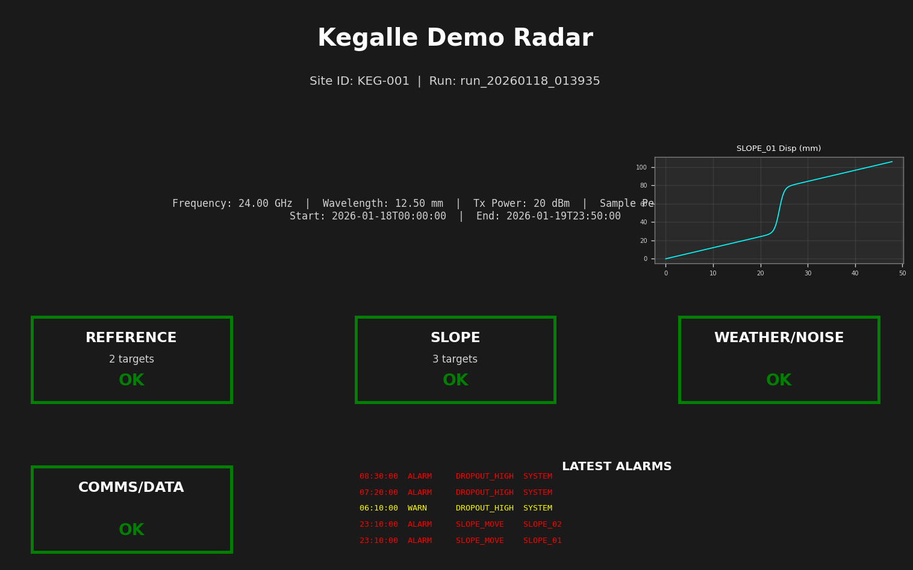

# Smartslope HMI Results: Kegalle Demo Radar

**Run ID:** `run_20260118_013935`

**Site ID:** KEG-001

## Station Parameters

| Parameter | Value |
|-----------|-------|
| Frequency | 24.00 GHz |
| Wavelength | 12.50 mm |
| Tx Power | 20 dBm |
| Sample Period | 10.0 min (600 s) |
| Run Duration | 48.0 hours (172800 s) |
| Start Time | 2026-01-18T00:00:00-08:00 |
| End Time | 2026-01-19T23:50:00-08:00 |

## Reflector Summary

| Name | Role | Position (x, y, z) [m] | Range [m] |
|------|------|------------------------|----------|
| REF_A | ref | (200.0, -50.0, 10.0) | 206.3 |
| REF_B | ref | (210.0, 40.0, 12.0) | 214.0 |
| SLOPE_01 | slope | (1000.0, -80.0, 60.0) | 1004.9 |
| SLOPE_02 | slope | (1020.0, -10.0, 55.0) | 1021.4 |
| SLOPE_03 | slope | (990.0, 60.0, 50.0) | 993.0 |

## Key Figures

### 3D Scene Geometry

### Scene Before/After

### HMI Station Dashboard

### Alarm Timeline

### Time-Series Grid

## Alarm Log

### Alarm Code Definitions

- **REF_MOVE** (CRITICAL): Reference target displacement exceeds threshold
- **SLOPE_MOVE** (ALARM): Slope target movement rate exceeds threshold
- **HIGH_NOISE** (WARN): High phase noise detected (possible bad weather)
- **DROPOUT_HIGH** (WARN/ALARM): High data dropout rate
- **DRIFT_HIGH** (WARN): High system drift rate

### Alarm Summary

**Total Alarms:** 13

- **CRITICAL:** 1
- **ALARM:** 4
- **WARN:** 8
- **INFO:** 0

### Recent Alarms (first 15)

| Time | Severity | Code | Target | Message |
|------|----------|------|--------|----------|
| 12:30:00 | WARN | HIGH_NOISE | SYSTEM | High phase noise detected: 0.740 rad (threshold: 0.600 rad) |
| 13:40:00 | WARN | HIGH_NOISE | SYSTEM | High phase noise detected: 1.086 rad (threshold: 0.600 rad) |
| 14:50:00 | WARN | HIGH_NOISE | SYSTEM | High phase noise detected: 1.218 rad (threshold: 0.600 rad) |
| 16:00:00 | WARN | HIGH_NOISE | SYSTEM | High phase noise detected: 1.168 rad (threshold: 0.600 rad) |
| 17:10:00 | WARN | HIGH_NOISE | SYSTEM | High phase noise detected: 1.174 rad (threshold: 0.600 rad) |
| 18:20:00 | CRITICAL | REF_MOVE | REF_A | Reference REF_A moved 4.85 mm (threshold: 2.00 mm) |
| 18:20:00 | WARN | HIGH_NOISE | SYSTEM | High phase noise detected: 1.105 rad (threshold: 0.600 rad) |
| 23:00:00 | WARN | HIGH_NOISE | SYSTEM | High phase noise detected: 0.647 rad (threshold: 0.600 rad) |
| 23:10:00 | ALARM | SLOPE_MOVE | SLOPE_01 | Slope SLOPE_01 moving at 12.67 mm/hr (threshold: 10.00 mm/hr) |
| 23:10:00 | ALARM | SLOPE_MOVE | SLOPE_02 | Slope SLOPE_02 moving at 12.73 mm/hr (threshold: 10.00 mm/hr) |
| 06:10:00 | WARN | DROPOUT_HIGH | SYSTEM | High dropout rate: 26.7% (threshold: 25.0%) |
| 07:20:00 | ALARM | DROPOUT_HIGH | SYSTEM | High dropout rate: 60.0% (threshold: 25.0%) |
| 08:30:00 | ALARM | DROPOUT_HIGH | SYSTEM | High dropout rate: 56.7% (threshold: 25.0%) |

**Full alarm log:** See [alarm_log.csv](alarm_log.csv)

## Notes

**Operator Note:** Synthetic run for alarm validation

### Alarm Injection Scenarios

This synthetic run includes forced alarm scenarios for validation:

- **bad_weather_noise_burst**:
  - Start: 12.0 hr (43200 s)
  - Duration: 6.0 hr (21600 s)
  - Effect: Extra phase noise (σ = 1.00 rad)

- **ref_instability**:
  - Start: 18.0 hr (64800 s)
  - Duration: 4.0 hr (14400 s)
  - Effect: Forced displacement on REF_A (5.0 mm)

- **dropout_burst**:
  - Start: 30.0 hr (108000 s)
  - Duration: 3.0 hr (10800 s)
  - Effect: Extra dropout probability (60%)

---

*Generated by Smartslope 3D simulation pipeline*
