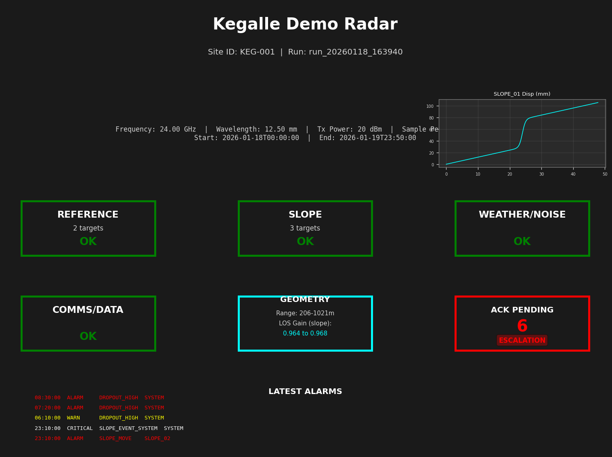

# Smartslope HMI Results: Kegalle Demo Radar

**Run ID:** `run_20260118_163940`

**Site ID:** KEG-001

## Station Parameters

| Parameter | Value |
|-----------|-------|
| Frequency | 24.00 GHz |
| Wavelength | 12.50 mm |
| Tx Power | 20 dBm |
| Sample Period | 10.0 min (600 s) |
| Run Duration | 48.0 hours (172800 s) |
| Start Time | 2026-01-18T00:00:00-08:00 |
| End Time | 2026-01-19T23:50:00-08:00 |

## Reflector Summary

| Name | Role | Position (x, y, z) [m] | Range [m] |
|------|------|------------------------|----------|
| REF_A | ref | (200.0, -50.0, 10.0) | 206.3 |
| REF_B | ref | (210.0, 40.0, 12.0) | 214.0 |
| SLOPE_01 | slope | (1000.0, -80.0, 60.0) | 1004.9 |
| SLOPE_02 | slope | (1020.0, -10.0, 55.0) | 1021.4 |
| SLOPE_03 | slope | (990.0, 60.0, 50.0) | 993.0 |

## Key Figures

### 3D Scene Geometry

### Scene Before/After

### 2D Engineering Views

#### Plan View (Top-Down)

#### Elevation View (Distance vs Height)

### HMI Station Dashboard

### Alarm Timeline

### Time-Series Grid

## Geometry & Sensitivity

### System Summary

- **Wavelength:** 12.50 mm
- **Frequency:** 24.00 GHz
- **Reference Targets:** 2
- **Slope Targets:** 3
- **Range:** 206 - 1021 m
- **LOS Gain (slope):** 0.964 to 0.968

### Reflector Geometry Metrics

| Name | Role | Range [m] | Vertical [°] | Azimuth [°] | LOS Gain | Predicted LOS mm/mm |
|------|------|-----------|--------------|-------------|----------|---------------------|
| REF_A | ref | 206.3 | 2.2 | 104.0 | N/A | N/A |
| REF_B | ref | 214.0 | 2.7 | 79.2 | N/A | N/A |
| SLOPE_01 | slope | 1004.9 | 3.3 | 94.6 | 0.964 | 0.964 |
| SLOPE_02 | slope | 1021.4 | 3.0 | 90.6 | 0.968 | 0.968 |
| SLOPE_03 | slope | 993.0 | 2.8 | 86.5 | 0.967 | 0.967 |

**LOS Gain Interpretation:**
- **1.0** = motion directly along line-of-sight (maximum sensitivity, positive)
- **-1.0** = motion directly opposite line-of-sight (maximum sensitivity, negative)
- **0.0** = motion perpendicular to line-of-sight (invisible to radar)

**Predicted LOS mm/mm:** Shows how much LOS displacement (mm) results from 1 mm true motion in the target's motion direction. Equal to LOS gain when motion direction is normalized.

**Data Files:**
- [geometry_metrics.csv](geometry_metrics.csv)
- [geometry_metrics.json](geometry_metrics.json)

## Alarm Log

### Alarm Code Definitions

- **REF_MOVE** (CRITICAL): Reference target displacement exceeds threshold
- **SLOPE_MOVE** (ALARM): Slope target movement rate exceeds threshold
- **SLOPE_EVENT_SYSTEM** (CRITICAL): Multiple slope targets moving (K-of-N consensus)
- **HIGH_NOISE** (WARN): High phase noise detected (possible bad weather)
- **DROPOUT_HIGH** (WARN/ALARM): High data dropout rate
- **DRIFT_HIGH** (WARN): High system drift rate

### Alarm Summary

**Total Alarms:** 14

- **CRITICAL:** 2
- **ALARM:** 4
- **WARN:** 8
- **INFO:** 0

### Alarm Operations (Latching & Acknowledgment)

**Active Alarms:** 8

**Latched Alarms (awaiting acknowledgment):** 6
  - CRITICAL unacknowledged: 2
  - ALARM unacknowledged: 4

**Acknowledged Alarms:** 0

**Escalation:** ⚠️  2 CRITICAL alarm(s) unacknowledged for >30 minutes

**Latching Behavior:**
- Alarms with severity ALARM or CRITICAL will latch (persist) until acknowledged.
- To acknowledge alarms, create an `alarm_ack.json` file in the run directory.
- See `alarm_ack_template.json` for format.

**Data Files:**
- [alarm_state.json](alarm_state.json) - Full alarm state snapshot
- [alarm_log.csv](alarm_log.csv) - Complete alarm log with state columns
- [scada_telemetry.csv](scada_telemetry.csv) - Time-series telemetry for SCADA integration

### Recent Alarms (first 15)

| Time | Severity | Code | Target | Message |
|------|----------|------|--------|----------|
| 12:30:00 | WARN | HIGH_NOISE | SYSTEM | High phase noise detected: 0.740 rad (threshold: 0.600 rad) |
| 13:40:00 | WARN | HIGH_NOISE | SYSTEM | High phase noise detected: 1.086 rad (threshold: 0.600 rad) |
| 14:50:00 | WARN | HIGH_NOISE | SYSTEM | High phase noise detected: 1.218 rad (threshold: 0.600 rad) |
| 16:00:00 | WARN | HIGH_NOISE | SYSTEM | High phase noise detected: 1.168 rad (threshold: 0.600 rad) |
| 17:10:00 | WARN | HIGH_NOISE | SYSTEM | High phase noise detected: 1.174 rad (threshold: 0.600 rad) |
| 18:20:00 | CRITICAL | REF_MOVE | REF_A | Reference REF_A moved 4.85 mm (threshold: 2.00 mm) |
| 18:20:00 | WARN | HIGH_NOISE | SYSTEM | High phase noise detected: 1.105 rad (threshold: 0.600 rad) |
| 23:00:00 | WARN | HIGH_NOISE | SYSTEM | High phase noise detected: 0.647 rad (threshold: 0.600 rad) |
| 23:10:00 | ALARM | SLOPE_MOVE | SLOPE_01 | Slope SLOPE_01 moving at 12.67 mm/hr (threshold: 10.00 mm/hr) |
| 23:10:00 | ALARM | SLOPE_MOVE | SLOPE_02 | Slope SLOPE_02 moving at 12.73 mm/hr (threshold: 10.00 mm/hr) |
| 23:10:00 | CRITICAL | SLOPE_EVENT_SYSTEM | SYSTEM | Slope consensus: 2 targets moving (SLOPE_01, SLOPE_02) |
| 06:10:00 | WARN | DROPOUT_HIGH | SYSTEM | High dropout rate: 26.7% (threshold: 25.0%) |
| 07:20:00 | ALARM | DROPOUT_HIGH | SYSTEM | High dropout rate: 60.0% (threshold: 25.0%) |
| 08:30:00 | ALARM | DROPOUT_HIGH | SYSTEM | High dropout rate: 56.7% (threshold: 25.0%) |

**Full alarm log:** See [alarm_log.csv](alarm_log.csv)

## Notes

**Operator Note:** Synthetic run for alarm validation

### Alarm Injection Scenarios

This synthetic run includes forced alarm scenarios for validation:

- **bad_weather_noise_burst**:
  - Start: 12.0 hr (43200 s)
  - Duration: 6.0 hr (21600 s)
  - Effect: Extra phase noise (σ = 1.00 rad)

- **ref_instability**:
  - Start: 18.0 hr (64800 s)
  - Duration: 4.0 hr (14400 s)
  - Effect: Forced displacement on REF_A (5.0 mm)

- **dropout_burst**:
  - Start: 30.0 hr (108000 s)
  - Duration: 3.0 hr (10800 s)
  - Effect: Extra dropout probability (60%)

---

*Generated by Smartslope 3D simulation pipeline*
